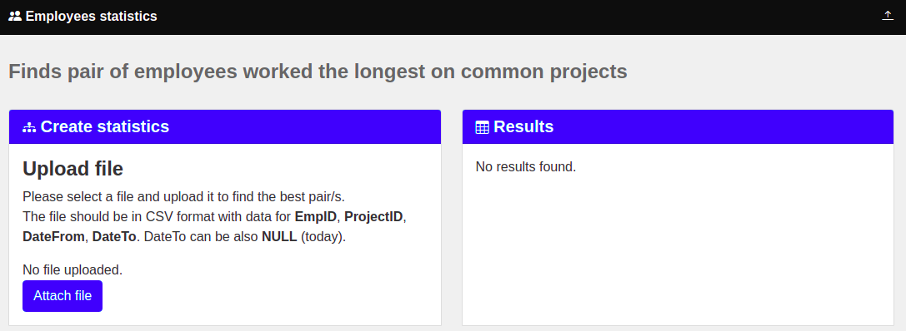
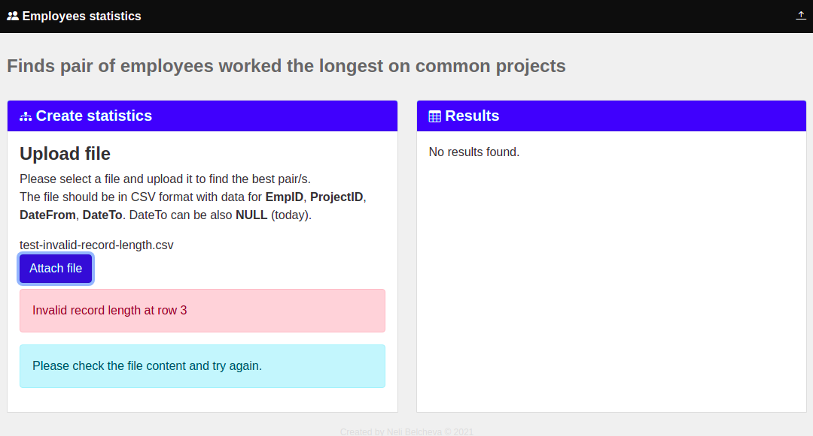
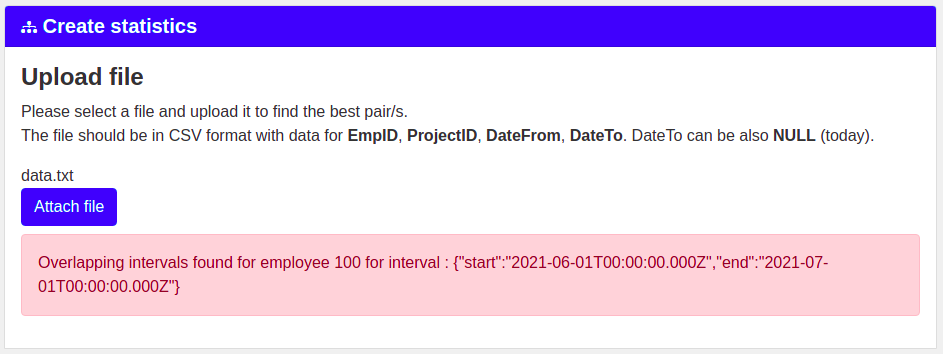
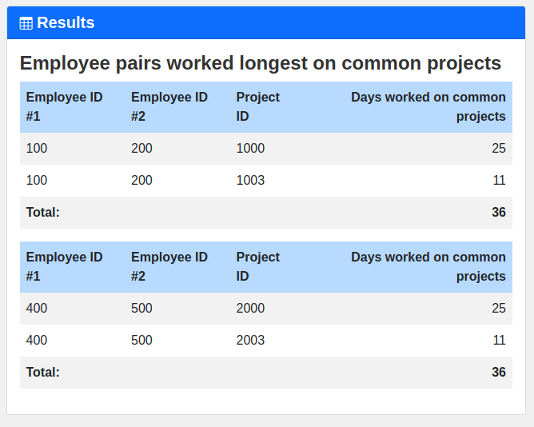

# Find employee pairs worked longest on common projects.
### Nelly Belcheva

This project was generated with [Angular CLI](https://github.com/angular/angular-cli) version 12.2.8.

## Assignment 
Find all employee pairs worked longest on common projects.

#### The employee information comes from a text file in the following format:
```csv
EmpID, ProjectID, DateFrom, DateTo
```

#### Sample data
```csv
143, 12, 2013-11-01, 2014-01-05
218, 10, 2012-05-16, NULL
143, 10, 2009-01-01, 2011-04-27
...
```

#### Prerequisites

* DateTo can be 'NULL' which is interpred as current date
* To demonstrate the validation employee and project ids are expected to be positive numbers. This can be easily changed if strings are required. 
* More than one work log per project is supported. Employee can work on one project, then switch to something else and the return to the original project. 
* Overlapped periods are not supported. As the log granularity is day each employee should work on one project maximum on given date

### Solution

#### Input data
The application expects text file in the specified format to be attached.



#### Validation
If the application detect invalid input data, validation errors are displayed:



The program doesn't allow project overlapping for employees.
The following input data is not accepted:
```csv
...
100,1,2021-09-01,2021-10-01
100,2,2021-09-20,2021-12-20
... 
```

Although, the application allows more than one project log for single employee.
```csv
...
100,1,2021-09-01,2021-10-01
100,1,2021-11-20,2021-12-20
... 

```

If overlapped work log is detected the following error is displayed:



#### Results

If the input data is valid the application finds the best pair.

If there is more than one pair, the pair information is displayed in separate tables.



### Build & run

You need to install Node.js and then the development tools. Node.js comes with a package manager called [npm](http://npmjs.org) for installing NodeJS applications and libraries.
* [Install node.js](http://nodejs.org/download/) 

#### Get the Code

Either clone this repository or fork it on GitHub and clone your fork:

```
git clone https://github.com/nellyB12/Nelly-Belcheva-Employees.git
cd Nelly-Belcheva-Employees
nmp install
```


#### Development server

Run `ng serve` for a dev server. Navigate to `http://localhost:4200/`. The app will automatically reload if you change any of the source files.

#### Build

Run `ng build` to build the project. The build artifacts will be stored in the `dist/` directory.


